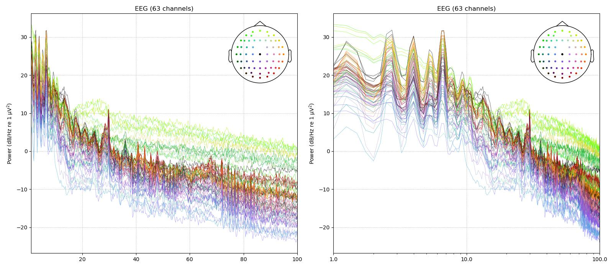

# EEG data management, preprocessing, and analysis for studying sustained attention.

The goal of this workshop is three-fold. First, we will review the basics of EEG signal preprocessing. As opposed to e.g. intracortical recordings, EEG is a non-invasive method which allows researchers to simply record brain activity by using electrodes at the surface of the scalp with a very good temporal resolution. This ease of use comes at the cost of a lower signal-to-noise ratio: the raw EEG signal is often noisy, and muscular artifacts (e.g. from blinking) can be several orders of magnitude larger than the signal of interest. Using the MNE Python package, we will thus review the main techniques (filtering and ICA) for preprocessing raw data and extracting relevant features. 

Second, due to their high sampling frequency and to the length of experiments, EEG datasets are often very large, thereby complicating data sharing and open science initiatives. We will use DataLad (an open source data management system based on Git which can be used for version control and sharing of large datasets) to recover a publicly available dataset of EEG recordings. 

Third (although this will only be introduced during the workshop, and expanded upon during the hackathon), we will explore how EEG activity is linked to attention. The aforementioned dataset was recorded while participants performed a sustained attention task: comparing EEG features between correct trials and commission errors allows to determine the neural signatures of lapses of attention.

### References

The workshop materials will be written in Python and run in a Jupyter notebook. It is expected to be self-contained, but interested students can check the following references:

- [Cha, Y., Lee, Y., Ji, E., Han, S., Min, S., Kim, H., ... & Moon, J. Y. (2026). Sustained attention task (gradCPt) Dataset using simultaneous EEG-fMRI and DtI. Scientific Data, 13(1), 573.]( https://www.nature.com/articles/s41597-026-06616-6): The paper describing the dataset;
- [Jin, C. Y., Borst, J. P., & Van Vugt, M. K. (2019). Predicting task-general mind-wandering with EEG. Cognitive, Affective, & Behavioral Neuroscience, 19(4), 1059-1073.](  https://link.springer.com/article/10.3758/s13415-019-00707-1) 
- [Chidharom, M., Jones, H. M., Rosenberg, M. D., & Vogel, E. K. (2025). Decoding Distraction From the Human Brain: A Unique Neural Signature Beyond Failures of Selective Attention and Control. bioRxiv, 2025-09.](  https://www.biorxiv.org/content/10.1101/2025.09.24.678372v2.abstract ): Other references studying how behavior and brain activity are influenced by the attention state;
- A series of YouTube video on EEG preprocessing: https://www.youtube.com/playlist?list=PLn0OLiymPak2gDD-VDA90w9_iGDgOOb2o

### Installation 

In order to save time, students are also encouraged to do the following:
- Ensure Python is installed and usable. A practical solution is to install Anaconda, a full setup for data science: https://www.anaconda.com/download#download-section
- Install Git: https://git-scm.com/install/windows
- Install DataLad: https://handbook.datalad.org/en/latest/intro/installation.html#install
- A quickstart guide for accessing OpenNeuro datasets is available at https://handbook.datalad.org/en/latest/usecases/openneuro.html and a more complete guide on installing datasets at https://handbook.datalad.org/en/latest/basics/101-105-install.html. The dataset we will use in the hackathon is https://openneuro.org/datasets/ds006040/versions/1.0.1
- Install the MNE (https://mne.tools/stable/install/index.html) and PyPREP (https://pypi.org/project/pyprep/) libraries. 
